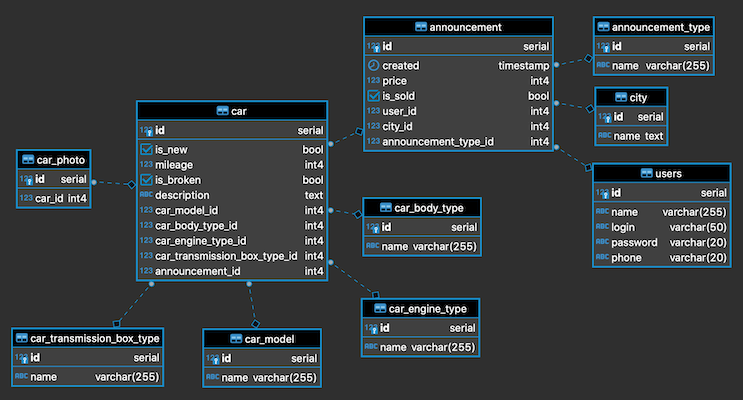
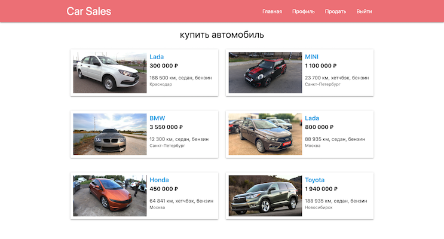
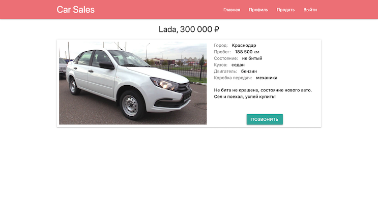
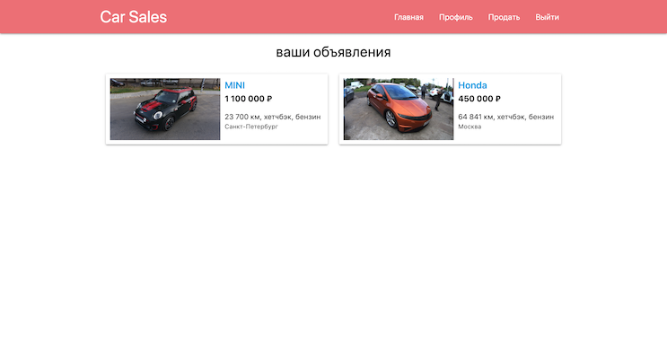
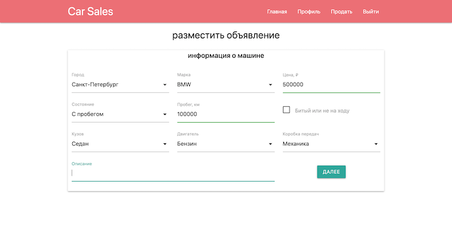
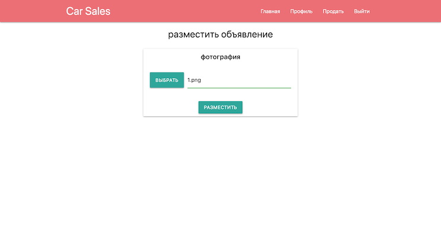
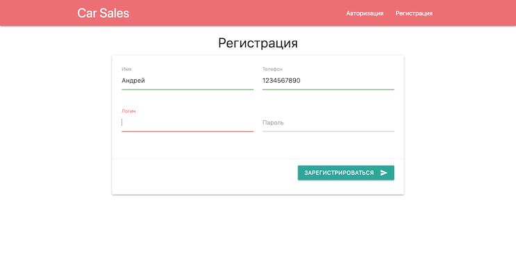

# Car Sales
[](https://travis-ci.org/ReyBos/job4j_cars) &nbsp;&nbsp;
[](https://codecov.io/gh/ReyBos/job4j_cars)

<a name="menu"></a>
<ul>
    <li>
        <a href="#about">О проекте</a>
        <ul>
            <li><a href="#description">Описание</a></li>
            <li><a href="#technologies">Технологии</a></li>
            <li><a href="#structure">Структура</a></li>
            <li><a href="#scheme">Схема БД</a></li>
        </ul>
    </li>
    <li>
        <a href="#build">Сборка</a>
    </li>
    <li>
        <a href="#intarface">Пользовательский интерфейс</a>
        <ul>
            <li><a href="#main_page">Главная страница</a></li>
            <li><a href="#car_info">Карточка товара</a></li>
            <li><a href="#profile">Профиль пользователя</a></li>
            <li>
                <a href="#announcement">Размещение объявления</a>
                <ul>
                    <li><a href="#announcement_form">Форма</a></li>
                    <li><a href="#announcement_photo">Фотография</a></li>
                </ul>
            </li>
            <li><a href="#reg_page">Регистрация/авторизация</a></li>
        </ul>
    </li>
    <li>
        <a href="#links">Полезные ссылки</a>
    </li>
    <li>
        <a href="#contact">Контакты</a>
    </li>
</ul>

<h2><a name="about">О проекте</a>&nbsp;&nbsp;<a href="#menu">&#9650;</a></h2>
<h4><a name="description">Описание</a>&nbsp;&nbsp;<a href="#menu">&#9650;</a></h4>
<p>
    Проект для изучения Java EE.
</p>
<p>
    Это приложение - площадка по продаже машин. Каждый пользователь может добавлять новые объявления 
    о продаже, менять их статус. На главной странице приложения собраны все активные
    объявления с возможностью подробно ознакомиться с каждым из них.
</p>

<h4><a name="technologies">Технологии</a>&nbsp;&nbsp;<a href="#menu">&#9650;</a></h4>
<ul>
    <li>Java 14</li>
    <li>Java EE Servlets, JSP, JSTL</li>
    <li>PostgreSQL, Hibernate, Liquibase</li>
    <li>JUnit, Mockito, PowerMock</li>
    <li>Maven, Tomcat</li>
    <li>HTML, JavaScript, jQuery, JSON</li>
    <li><a href="https://materializecss.com">Material Design library</a></li>
</ul>

<h4><a name="structure">Структура</a>&nbsp;&nbsp;<a href="#menu">&#9650;</a></h4>
<pre><code>.
</code></pre>

<h4><a name="scheme">Схема БД</a>&nbsp;&nbsp;<a href="#menu">&#9650;</a></h4>
<p align="center">
  
</p>

<h2><a name="build">Сборка</a>&nbsp;&nbsp;<a href="#menu">&#9650;</a></h2>
<ol>
    <li>
        Для успешной сборки и работы проекта на вашем компьютере должны быть установлены:
        <ol>
            <li>JDK 14(+)</li>
            <li>Maven</li>
            <li>PostgreSQL</li>
            <li>Tomcat</li>
        </ol>
    </li>
    <li>
        В PostgreSQL создайте базу с именем "job4j_cars"
    </li>
    <li>
        Скачайте проект к себе на компьютер с помощью команды<br>
        <code>git clone https://github.com/ReyBos/job4j_cars.git</code><br>
        перейдите в корень проекта
    </li>
    <li>
        Добавьте настройки для доступа к базе данных, для этого внесите соответствующие изменения в файле 
        <code>src/main/resources/hibernate.cfg.xml</code><br>
        и в файле конфигурации проекта <code>pom.xml</code>
    
``` 
<profile>   
    <id>production</id>
    <properties>
        <db.url>jdbc:postgresql://127.0.0.1:5432/job4j_cars</db.url>
        <db.username>postgres</db.username>
        <db.password>password</db.password>
        <db.driver>org.postgresql.Driver</db.driver>
    </properties>
</profile>
```
</li>
    <li>
        Выполните команду <code>mvn install -Pproduction</code> в корне проекта для его сборки<br>
        Будет выполнена миграция БД с помощью Liquibase.<br>
        В случае успешной сборки появится файл <code>target/cars-&#60;version&#62;.war</code><br>
        переименуйте его в <code>cars.war</code>
    </li>
    <li>
        Для запуска веб-приложения вам нужно скопировать <code>cars.war</code> в папку <code>webapps</code> вашего Tomcat
    </li>
    <li>
        После запуска сервера приложение будет доступно по адресу<br>
        <a href="http://localhost:8080/cars/">http://localhost:8080/cars/</a>
    </li>
</ol>

<h2><a name="intarface">Пользовательский интерфейс</a>&nbsp;&nbsp;<a href="#menu">&#9650;</a></h2>

<h3><a name="main_page">Главная страница</a>&nbsp;&nbsp;<a href="#menu">&#9650;</a></h3>
<p>
    На главной странице собраны все активные объявления с основной информацией.
</p>
<p align="center">
  
</p>

<h3><a name="car_info">Карточка товара</a>&nbsp;&nbsp;<a href="#menu">&#9650;</a></h3>
<p>
    Для каждого объявления можно посмотреть всю доступную информацию о нем, а также контакты продавца.
    Создатель объявления может снять его с продажи в этом разделе.
</p>
<p align="center">
  
</p>

<h3><a name="profile">Профиль пользователя</a>&nbsp;&nbsp;<a href="#menu">&#9650;</a></h3>
<p>
    В профиле пользователя собраны все его активные и завершенные объявления.
</p>
<p align="center">
  
</p>

<h3><a name="announcement">Размещение объявления</a>&nbsp;&nbsp;<a href="#menu">&#9650;</a></h3>
<h4><a name="announcement_form">Форма</a>&nbsp;&nbsp;<a href="#menu">&#9650;</a></h4>
<p>
    Размещение объявления о продаже машины происходит в два этапа. На первом этапе пользователь
    заполняет форму с информацией о машине.
</p>
<p align="center">
  
</p>

<h4><a name="announcement_photo">Фотография</a>&nbsp;&nbsp;<a href="#menu">&#9650;</a></h4>
<p>
    Следующим шагом пользовтелю будет предложено выбрать фотографию машины. Пропустить этот шаг нельзя.
</p>
<p align="center">
  
</p>

<h3><a name="reg_page">Регистрация/авторизация</a>&nbsp;&nbsp;<a href="#menu">&#9650;</a></h3>
<p>
    Всем пользователям доступна главная страница приложения со списком активных объявлений. 
    Для того что бы был доступен полный функционал приложения (возможность добавлять объявления о продаже,
    просмотр контактов владельцев), пользователь должен быть зарегистрирова/авторизован.
</p>
<p align="center">
  
</p>

<h2><a name="links">Полезные ссылки</a>&nbsp;&nbsp;<a href="#menu">&#9650;</a></h2>
<p>Ресурсы которые были полезны при создании проекта</p>
<ul>
    <li>
        <strong><a href="https://ru.stackoverflow.com/questions/381936/%D0%9F%D0%B5%D1%80%D0%B5%D0%B4%D0%B0%D1%82%D1%8C-%D1%87%D0%B5%D1%80%D0%B5%D0%B7-ajax-%D0%B4%D0%B0%D0%BD%D0%BD%D1%8B%D0%B5-%D1%84%D0%BE%D1%80%D0%BC%D1%8B-file">link</a></strong>
        - ajax отправка файла из формы
    </li>
    <!--<li>
        <strong><a href="">link</a></strong>
        - настройка логирования Hibernate
    </li>-->
</ul>

<h2><a name="contact">Контакты</a>&nbsp;&nbsp;<a href="#menu">&#9650;</a></h2>
<p>Связаться со мной по всем интересующим вопросам вы можете здесь:</p>

[](https://www.linkedin.com/in/reybos/)&nbsp;&nbsp;
[](https://vk.com/reybos)&nbsp;&nbsp;
[](https://www.instagram.com/andreybossiy)&nbsp;&nbsp;
[](https://t.me/reybos)&nbsp;&nbsp;
[](mailto:andreybosiy@yandex.ru)&nbsp;&nbsp;