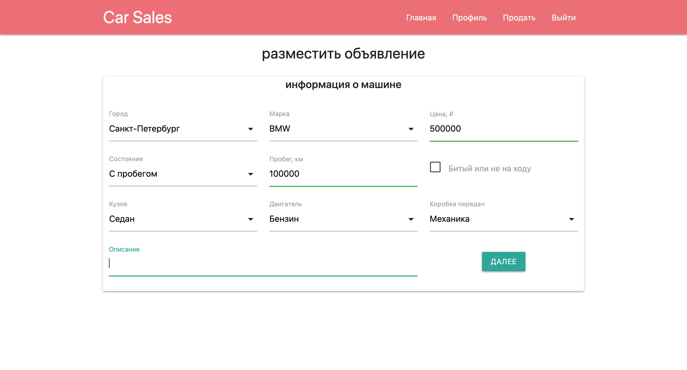
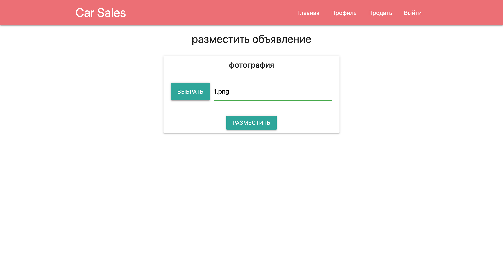

# Car Sales
[](https://travis-ci.org/ReyBos/job4j_cars) &nbsp;&nbsp;
[](https://codecov.io/gh/ReyBos/job4j_cars)

<a name="menu"></a>
<ul>
    <li>
        <a href="#about">О проекте</a>
        <ul>
            <li><a href="#description">Описание</a></li>
            <li><a href="#technologies">Технологии</a></li>
            <li><a href="#structure">Структура</a></li>
            <li><a href="#scheme">Схема БД</a></li>
        </ul>
    </li>
    <li>
        <a href="#build">Сборка</a>
    </li>
    <li>
        <a href="#api">API</a>
        <ul>
            <li><a href="#api_user">user</a></li>
            <li><a href="#api_announcement">announcement</a></li>
        </ul>
    </li>
    <li>
        <a href="#intarface">Пользовательский интерфейс</a>
        <ul>
            <li><a href="#main_page">Главная страница</a></li>
            <li><a href="#car_info">Карточка товара</a></li>
            <li><a href="#profile">Профиль пользователя</a></li>
            <li>
                <a href="#announcement">Размещение объявления</a>
                <ul>
                    <li><a href="#announcement_form">Форма</a></li>
                    <li><a href="#announcement_photo">Фотография</a></li>
                </ul>
            </li>
            <li><a href="#reg_page">Регистрация/авторизация</a></li>
        </ul>
    </li>
    <li>
        <a href="#links">Полезные ссылки</a>
    </li>
    <li>
        <a href="#contact">Контакты</a>
    </li>
</ul>

<h2><a name="about">О проекте</a>&nbsp;&nbsp;<a href="#menu">&#9650;</a></h2>
<h4><a name="description">Описание</a>&nbsp;&nbsp;<a href="#menu">&#9650;</a></h4>
<p>
    Проект для изучения Java EE.
</p>
<p>
    Это приложение - площадка по продаже машин. Каждый пользователь может добавлять новые объявления 
    о продаже, менять их статус. На главной странице приложения собраны все активные
    объявления с возможностью подробно ознакомиться с каждым из них.
</p>

<h4><a name="technologies">Технологии</a>&nbsp;&nbsp;<a href="#menu">&#9650;</a></h4>
<ul>
    <li>Java 14</li>
    <li>Java EE Servlets, JSP, JSTL</li>
    <li>PostgreSQL, Hibernate, Liquibase</li>
    <li>JUnit, Mockito, PowerMock</li>
    <li>Maven, Tomcat</li>
    <li>HTML, JavaScript, jQuery, JSON</li>
    <li><a href="https://materializecss.com">Material Design library</a></li>
</ul>

<h4><a name="structure">Структура</a>&nbsp;&nbsp;<a href="#menu">&#9650;</a></h4>
<pre><code>.
|-db
|---scripts
|-images
|-src
|---main
|-----java
|-------ru
|---------reybos
|-----------filter
|-----------helper
|-------------serialize
|-----------model
|-------------announcement
|-------------car
|-----------service
|-----------servlet
|-----------store
|-----resources
|-----webapp
|-------WEB-INF
|-------announcement
|-------css
|-------img
|-------js
|---test
|-----java
|-------ru
|---------reybos
|-----------model
|-------------announcement
|-----------service
|-----------servlet
|-----------store
└-----resources
</code></pre>

<h4><a name="scheme">Схема БД</a>&nbsp;&nbsp;<a href="#menu">&#9650;</a></h4>
<p align="center">
  
</p>

<h2><a name="build">Сборка</a>&nbsp;&nbsp;<a href="#menu">&#9650;</a></h2>
<ol>
    <li>
        Для успешной сборки и работы проекта на вашем компьютере должны быть установлены:
        <ol>
            <li>JDK 14(+)</li>
            <li>Maven</li>
            <li>PostgreSQL</li>
            <li>Tomcat</li>
        </ol>
    </li>
    <li>
        В PostgreSQL создайте базу с именем "job4j_cars"
    </li>
    <li>
        Скачайте проект к себе на компьютер с помощью команды<br>
        <code>git clone https://github.com/ReyBos/job4j_cars.git</code><br>
        перейдите в корень проекта
    </li>
    <li>
        Добавьте настройки для доступа к базе данных, для этого внесите соответствующие изменения в файле 
        <code>src/main/resources/hibernate.cfg.xml</code><br>
        и в файле конфигурации проекта <code>pom.xml</code>
    
``` 
<profile>   
    <id>production</id>
    <properties>
        <db.url>jdbc:postgresql://127.0.0.1:5432/job4j_cars</db.url>
        <db.username>postgres</db.username>
        <db.password>password</db.password>
        <db.driver>org.postgresql.Driver</db.driver>
    </properties>
</profile>
```
</li>
    <li>
        Выполните команду <code>mvn install -Pproduction</code> в корне проекта для его сборки<br>
        Будет выполнена миграция БД с помощью Liquibase.<br>
        В случае успешной сборки появится файл <code>target/cars-&#60;version&#62;.war</code><br>
        переименуйте его в <code>cars.war</code>
    </li>
    <li>
        Для запуска веб-приложения вам нужно скопировать <code>cars.war</code> в папку <code>webapps</code> вашего Tomcat
    </li>
    <li>
        После запуска сервера приложение будет доступно по адресу<br>
        <a href="http://localhost:8080/cars/">http://localhost:8080/cars/</a>
    </li>
</ol>

<h2><a name="api">API</a>&nbsp;&nbsp;<a href="#menu">&#9650;</a></h2>
<p>
    Для более быстрого знакомства с приложением собраны основные запросы. 
    Также указанны сервлеты которые их обрабатывают.
</p>

<h3><a name="api_user">user</a>&nbsp;&nbsp;<a href="#menu">&#9650;</a></h3>
<p>
    Все операции с пользователем<br>
    <code>ru.reybos.servlet.UserServlet</code>
</p>
<div>
    <details>
        <summary>
            <strong><code>&nbsp;&nbsp;POST&nbsp;&nbsp;</code></strong> &nbsp;&nbsp; <strong>/user?action=registration</strong> &nbsp;&nbsp; регистрация пользователя
        </summary>
        <p></p>
        <table>
            <tbody>
                <tr><th colspan=2><strong>Параметры</strong></th></tr>
                <tr>
                    <td>Имя</td>
                    <td>Описание</td>
                </tr>
                <tr>
                    <td rowspan=2>
                        <strong>тело запроса</strong> <sup>* required</sup><br>
                        <sup>object</sup>
                    </td>
                    <td rowspan=2>
                        
```json
{
    "login": "login",
    "password": "password",
    "phone": "phone",
    "name": "name"
}
```
</td>
                </tr>
                <tr></tr>
                <tr><th colspan=2><strong>Ответ</strong></th></tr>
                <tr>
                    <td>Код</td>
                    <td>Описание</td>
                </tr>
                <tr>
                    <td rowspan=2>200</td>
                    <td rowspan=2>удачная операция</td>
                </tr>
                <tr></tr>
                <tr>
                    <td>500</td>
                    <td>ошибка при выполнении запроса</td>
                </tr>
            </tbody>
        </table>
    </details>
    <details>
        <summary>
            <strong><code>&nbsp;&nbsp;POST&nbsp;&nbsp;</code></strong> &nbsp;&nbsp; <strong>/user?action=login</strong> &nbsp;&nbsp; авторизация пользователя
        </summary>
        <p></p>
        <table>
            <tbody>
                <tr><th colspan=2><strong>Параметры</strong></th></tr>
                <tr>
                    <td>Имя</td>
                    <td>Описание</td>
                </tr>
                <tr>
                    <td rowspan=2>
                        <strong>тело запроса</strong> <sup>* required</sup><br>
                        <sup>object</sup>
                    </td>
                    <td rowspan=2>
                        
```json
{
    "login": "login",
    "password": "password"
}
```
</td>
                </tr>
                <tr></tr>
                <tr><th colspan=2><strong>Ответ</strong></th></tr>
                <tr>
                    <td>Код</td>
                    <td>Описание</td>
                </tr>
                <tr>
                    <td rowspan=2>200</td>
                    <td rowspan=2>удачная операция</td>
                </tr>
                <tr></tr>
                <tr>
                    <td>500</td>
                    <td>ошибка при выполнении запроса</td>
                </tr>
            </tbody>
        </table>
    </details>
    <details>
        <summary>
            <strong><code>&nbsp;&nbsp;POST&nbsp;&nbsp;</code></strong> &nbsp;&nbsp; <strong>/user?action=logout</strong> &nbsp;&nbsp; выход из системы
        </summary>
        <p></p>
        <table>
            <tbody>
                <tr><th colspan=2><strong>Параметры</strong></th></tr>
                <tr>
                    <td>Имя</td>
                    <td>Описание</td>
                </tr>
                <tr>
                    <td colspan=2>
                        без параметров
                    </td>
                </tr>
                <tr></tr>
                <tr><th colspan=2><strong>Ответ</strong></th></tr>
                <tr>
                    <td>Код</td>
                    <td>Описание</td>
                </tr>
                <tr>
                    <td rowspan=2>200</td>
                    <td rowspan=2>удачная операция</td>
                </tr>
            </tbody>
        </table>
    </details>
</div>

<h3><a name="api_announcement">announcement</a>&nbsp;&nbsp;<a href="#menu">&#9650;</a></h3>
<p>
    Операции с объявлениями<br>
    <code>ru.reybos.servlet.AnnouncementServlet</code>
</p>
<div>
    <details>
        <summary>
            <strong><code>&nbsp;&nbsp;POST&nbsp;&nbsp;</code></strong> &nbsp;&nbsp; <strong>/announcement?action=get-form-fields</strong> &nbsp;&nbsp; получить данные для полей формы добавления нового объявления
        </summary>
        <p></p>
        <table>
            <tbody>
                <tr><th colspan=2><strong>Параметры</strong></th></tr>
                <tr>
                    <td>Имя</td>
                    <td>Описание</td>
                </tr>
                <tr>
                    <td colspan=2>
                        без параметров
                    </td>
                </tr>
                <tr></tr>
                <tr><th colspan=2><strong>Ответ</strong></th></tr>
                <tr>
                    <td>Код</td>
                    <td>Описание</td>
                </tr>
                <tr>
                    <td rowspan=2>200</td>
                    <td rowspan=2>
                    
```json
{
    "fields": {
        "cities": [
            {"id": 4, "name": "Казань"},
            {"id": 3, "name": "Краснодар"},
            {"id": 1, "name": "Москва"},
            {"id": 2, "name": "Санкт-Петербург"}
        ],
        "carModels": [
            {"id": 1, "name": "BMW"},
            {"id": 4, "name": "Honda"},
            {"id": 2, "name": "Lada"},
            {"id": 3, "name": "Toyota"}
        ],
        "carBodyTypes": [
            {"id": 1, "name": "Седан"},
            {"id": 3, "name": "Универсал"},
            {"id": 2, "name": "Хетчбэк"}
        ],
        "carEngineTypes": [
            {"id": 1, "name": "Бензин"},
            {"id": 2, "name": "Дизель"}
        ],
        "carTransmissionBoxTypes": [
            {"id": 2, "name": "Автомат"},
            {"id": 1, "name": "Механика"},
            {"id": 3, "name": "Робот"}
        ],
        "announcementType": {"id": 1, "name": "транспорт"},
    },
    "user": {
        "id": 1,
        "name": "Андрей", 
        "login": "test", 
        "phone": "1234567890"
    }
}
```
</td>
                </tr>
                <tr></tr>
                <tr>
                    <td>500</td>
                    <td>ошибка при выполнении запроса</td>
                </tr>
            </tbody>
        </table>
    </details>
    <details>
        <summary>
            <strong><code>&nbsp;&nbsp;POST&nbsp;&nbsp;</code></strong> &nbsp;&nbsp; <strong>/announcement?action=save</strong> &nbsp;&nbsp; сохранение нового объявления
        </summary>
        <p></p>
        <table>
            <tbody>
                <tr><th colspan=2><strong>Параметры</strong></th></tr>
                <tr>
                    <td>Имя</td>
                    <td>Описание</td>
                </tr>
                <tr>
                    <td rowspan=2>
                        <strong>тело запроса</strong> <sup>* required</sup><br>
                        <sup>object</sup>
                    </td>
                    <td rowspan=2>
                        
```json
{
    "price": 100000,
    "isSold": false,
    "city": {"id": 4},
    "announcementType": {"id": 1},
    "user": {"id": 1},
    "car": {
        "isNew": false,
        "mileage": 10000,
        "isBroken": false,
        "description": "Описание машины",
        "carModel" : {"id": 4},
        "carBodyType": {"id": 3},
        "carEngineType": {"id": 1},
        "carTransmissionBoxType": {"id": 2}
    }
}
```
</td>
                </tr>
                <tr></tr>
                <tr><th colspan=2><strong>Ответ</strong></th></tr>
                <tr>
                    <td>Код</td>
                    <td>Описание</td>
                </tr>
                <tr>
                    <td rowspan=2>200</td>
                    <td rowspan=2>

```json
{
    "id": 7,
    "created": "27-03-2021 16:00:00",
    "price": 100000,
    "isSold": false,
    "user": {
        "id": 1,
        "name": "Андрей",
        "login": "test",
        "phone": "1234567890"
    },
    "city": {"id": 4, "name": "Казань"},
    "announcementType": {"id": 1,"name": "транспорт"},
    "car": {
        "id": 6,
        "isNew": false,
        "mileage": 10000,
        "isBroken": false,
        "description": "Описание машины",
        "carModel": {"id": 4},
        "carBodyType": {"id": 3},
        "carEngineType": {"id": 1},
        "carTransmissionBoxType": {"id": 2},
        "carPhotos":[]
    }
}
```
</td>
                </tr>
                <tr></tr>
                <tr>
                    <td>500</td>
                    <td>ошибка при выполнении запроса</td>
                </tr>
            </tbody>
        </table>
    </details>
    <details>
        <summary>
            <strong><code>&nbsp;&nbsp;POST&nbsp;&nbsp;</code></strong> &nbsp;&nbsp; <strong>/announcement?action=update</strong> &nbsp;&nbsp; обновление объявления
        </summary>
        <p></p>
        <table>
            <tbody>
                <tr><th colspan=2><strong>Параметры</strong></th></tr>
                <tr>
                    <td>Имя</td>
                    <td>Описание</td>
                </tr>
                <tr>
                    <td rowspan=2>
                        <strong>тело запроса</strong> <sup>* required</sup><br>
                        <sup>object</sup>
                    </td>
                    <td rowspan=2>На сервер отправляются поля которые нужно изменить и айди объявления. На данный момент реализовано обновление одного поля.
                        
```json
{
    "isSold": true,
    "announcementId": 7,
}
```
</td>
                </tr>
                <tr></tr>
                <tr><th colspan=2><strong>Ответ</strong></th></tr>
                <tr>
                    <td>Код</td>
                    <td>Описание</td>
                </tr>
                <tr>
                    <td rowspan=2>200</td>
                    <td rowspan=2>

```json
{
    "id": 7,
    "created": "27-03-2021 16:00:00",
    "price": 100000,
    "isSold": true,
    "user": {
        "id": 1,
        "name": "Андрей",
        "login": "test",
        "phone": "1234567890"
    },
    "city": {"id": 4, "name": "Казань"},
    "announcementType": {"id": 1,"name": "транспорт"},
    "car": {
        "id": 6,
        "isNew": false,
        "mileage": 10000,
        "isBroken": false,
        "description": "Описание машины",
        "carModel": {"id": 4},
        "carBodyType": {"id": 3},
        "carEngineType": {"id": 1},
        "carTransmissionBoxType": {"id": 2},
        "carPhotos":[]
    }
}
```
</td>
                </tr>
                <tr></tr>
                <tr>
                    <td>500</td>
                    <td>ошибка при выполнении запроса</td>
                </tr>
            </tbody>
        </table>
    </details>
    <details>
        <summary>
            <strong><code>&nbsp;&nbsp;POST&nbsp;&nbsp;</code></strong> &nbsp;&nbsp; <strong>/announcement?action=get-user-announcement&id={userId}</strong> &nbsp;&nbsp; получить объявления пользователя
        </summary>
        <p></p>
        <table>
            <tbody>
                <tr><th colspan=2><strong>Параметры</strong></th></tr>
                <tr>
                    <td>Имя</td>
                    <td>Описание</td>
                </tr>
                <tr>
                    <td colspan=2>
                        без параметров
                    </td>
                </tr>
                <tr></tr>
                <tr><th colspan=2><strong>Ответ</strong></th></tr>
                <tr>
                    <td>Код</td>
                    <td>Описание</td>
                </tr>
                <tr>
                    <td rowspan=2>200</td>
                    <td rowspan=2>

```json
[
    {
        "id": 1,
        "created": "27-03-2021 20:02:16",
        "price": 12345,
        "isSold": false,
        "user": {
            "id": 1, 
            "name": "Андрей", 
            "login": "test", 
            "phone": "0987654321"
        },
        "city": {"id": 4, "name": "Казань"},
        "announcementType": {"id": 1, "name": "транспорт"},
        "car": {
            "id": 1,
            "isNew": false,
            "mileage": 13234,
            "isBroken": false,
            "description": "описание",
            "carModel": {"id": 1, "name": "BMW"},
            "carBodyType": {"id": 1, "name": "Седан"},
            "carEngineType": {"id": 1,"name": "Бензин"},
            "carTransmissionBoxType": {"id": 2,"name": "Автомат"},
            "carPhotos": [{"id": 1}]
        }
    }
]
```
</td>
                </tr>
                <tr></tr>
                <tr>
                    <td>500</td>
                    <td>ошибка при выполнении запроса</td>
                </tr>
            </tbody>
        </table>
    </details>
    <details>
        <summary>
            <strong><code>&nbsp;&nbsp;POST&nbsp;&nbsp;</code></strong> &nbsp;&nbsp; <strong>/announcement?action=get-all-announcement</strong> &nbsp;&nbsp; получить все активные объявления (статус не продано)
        </summary>
        <p></p>
        <table>
            <tbody>
                <tr><th colspan=2><strong>Параметры</strong></th></tr>
                <tr>
                    <td>Имя</td>
                    <td>Описание</td>
                </tr>
                <tr>
                    <td colspan=2>
                        без параметров
                    </td>
                </tr>
                <tr></tr>
                <tr><th colspan=2><strong>Ответ</strong></th></tr>
                <tr>
                    <td>Код</td>
                    <td>Описание</td>
                </tr>
                <tr>
                    <td rowspan=2>200</td>
                    <td rowspan=2>

```json
[
    {
        "id": 1,
        "created": "27-03-2021 20:02:16",
        "price": 12345,
        "isSold": false,
        "user": {
            "id": 1, 
            "name": "Андрей", 
            "login": "test", 
            "phone": "0987654321"
        },
        "city": {"id": 4, "name": "Казань"},
        "announcementType": {"id": 1, "name": "транспорт"},
        "car": {
            "id": 1,
            "isNew": false,
            "mileage": 13234,
            "isBroken": false,
            "description": "описание",
            "carModel": {"id": 1, "name": "BMW"},
            "carBodyType": {"id": 1, "name": "Седан"},
            "carEngineType": {"id": 1,"name": "Бензин"},
            "carTransmissionBoxType": {"id": 2,"name": "Автомат"},
            "carPhotos": [{"id": 1}]
        }
    }
]
```
</td>
                </tr>
                <tr></tr>
                <tr>
                    <td>500</td>
                    <td>ошибка при выполнении запроса</td>
                </tr>
            </tbody>
        </table>
    </details>
</div>

<h2><a name="intarface">Пользовательский интерфейс</a>&nbsp;&nbsp;<a href="#menu">&#9650;</a></h2>

<h3><a name="main_page">Главная страница</a>&nbsp;&nbsp;<a href="#menu">&#9650;</a></h3>
<p>
    На главной странице собраны все активные объявления с основной информацией.
</p>
<p align="center">
  
</p>

<h3><a name="car_info">Карточка товара</a>&nbsp;&nbsp;<a href="#menu">&#9650;</a></h3>
<p>
    Для каждого объявления можно посмотреть всю доступную информацию о нем, а также контакты продавца.
    Создатель объявления может снять его с продажи в этом разделе.
</p>
<p align="center">
  
</p>

<h3><a name="profile">Профиль пользователя</a>&nbsp;&nbsp;<a href="#menu">&#9650;</a></h3>
<p>
    В профиле пользователя собраны все его активные и завершенные объявления.
</p>
<p align="center">
  
</p>

<h3><a name="announcement">Размещение объявления</a>&nbsp;&nbsp;<a href="#menu">&#9650;</a></h3>
<h4><a name="announcement_form">Форма</a>&nbsp;&nbsp;<a href="#menu">&#9650;</a></h4>
<p>
    Размещение объявления о продаже машины происходит в два этапа. На первом этапе пользователь
    заполняет форму с информацией о машине.
</p>
<p align="center">
  
</p>

<h4><a name="announcement_photo">Фотография</a>&nbsp;&nbsp;<a href="#menu">&#9650;</a></h4>
<p>
    Следующим шагом пользовтелю будет предложено выбрать фотографию машины.
</p>
<p align="center">
  
</p>

<h3><a name="reg_page">Регистрация/авторизация</a>&nbsp;&nbsp;<a href="#menu">&#9650;</a></h3>
<p>
    Всем пользователям доступна главная страница приложения со списком активных объявлений. 
    Для того что бы был доступен полный функционал приложения (возможность добавлять объявления о продаже,
    просмотр контактов владельцев), пользователь должен быть зарегистрирова/авторизован.
</p>
<p align="center">
  
</p>

<h2><a name="links">Полезные ссылки</a>&nbsp;&nbsp;<a href="#menu">&#9650;</a></h2>
<p>Ресурсы которые были полезны при создании проекта</p>
<ul>
    <li>
        <strong><a href="https://habr.com/ru/company/naumen/blog/228279/">link</a></strong>
        - Gson пользовательская сериализация объектов
    </li>
    <li>
        <strong><a href="https://ru.stackoverflow.com/questions/381936/%D0%9F%D0%B5%D1%80%D0%B5%D0%B4%D0%B0%D1%82%D1%8C-%D1%87%D0%B5%D1%80%D0%B5%D0%B7-ajax-%D0%B4%D0%B0%D0%BD%D0%BD%D1%8B%D0%B5-%D1%84%D0%BE%D1%80%D0%BC%D1%8B-file">link</a></strong>
        - ajax отправка файла из формы
    </li>
    <li>
        <strong><a href="https://dba.stackexchange.com/questions/94887/what-is-the-impact-of-lc-ctype-on-a-postgresql-database">link</a></strong>
        - проблемы с сортировкой русских слов в postgresql на macos (решение для вновь создаваемой бд)
    </li>
    <li>
        <strong><a href="https://evtuhovich.ru/blog/2012/07/14/collate-osx-postgres/">link</a></strong>
        - проблемы с сортировкой русских слов в postgresql на macos (глобальное решение, но не попробовал пока)
    </li>
    <li>
        <strong><a href="https://simply.name/ru/pg-lc-collate.html">link</a></strong>
        - проблемы с сортировкой русских слов в postgresql на macos (решение на уровне запроса)
    </li>
    <!--<li>
        <strong><a href="">link</a></strong>
        - настройка логирования Hibernate
    </li>-->
</ul>

<h2><a name="contact">Контакты</a>&nbsp;&nbsp;<a href="#menu">&#9650;</a></h2>
<p>Связаться со мной по всем интересующим вопросам вы можете здесь:</p>

[](https://www.linkedin.com/in/reybos/)&nbsp;&nbsp;
[](https://vk.com/reybos)&nbsp;&nbsp;
[](https://www.instagram.com/andreybossiy)&nbsp;&nbsp;
[](https://t.me/reybos)&nbsp;&nbsp;
[](mailto:andreybosiy@yandex.ru)&nbsp;&nbsp;
